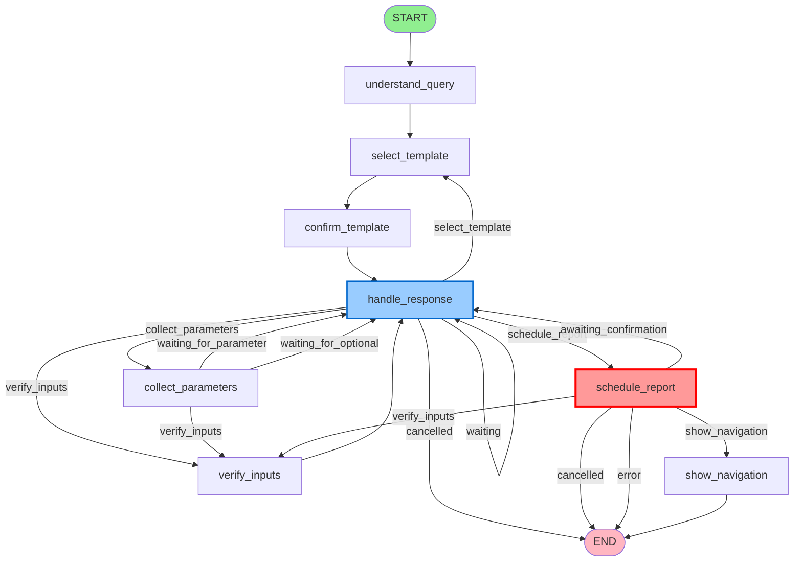

# LangGraph Reporting Agent - Complete Graph Structure

## 📊 Graph Visualization

### Nodes and Edges for Agent WITH Human-in-the-Loop Confirmation

## 🔵 All Nodes (8 Total)

```
1. understand_query          - Analyzes user query and fetches templates
2. select_template          - Selects most appropriate template using GPT-4
3. confirm_template         - Asks user to confirm template selection
4. handle_response          - Processes all user responses at various stages
5. collect_parameters       - Collects required and optional parameters
6. verify_inputs           - Shows summary and asks for final verification
7. schedule_report         - ⭐ Schedules report (WITH HITL CONFIRMATION)
8. show_navigation         - Displays report access instructions
```

## ➡️ All Edges

### 🟢 Direct Edges (Unconditional)

```
START → understand_query
understand_query → select_template
select_template → confirm_template
confirm_template → handle_response
verify_inputs → handle_response
show_navigation → END
```

### 🔶 Conditional Edges (Based on State)

#### From: handle_response

Routes based on `state['current_step']`:

```
handle_response → collect_parameters     (when current_step = "collect_parameters")
handle_response → select_template        (when current_step = "select_template")
handle_response → verify_inputs          (when current_step = "verify_inputs")
handle_response → schedule_report        (when current_step = "schedule_report")
handle_response → handle_response        (when current_step = "waiting_for_parameter")
handle_response → handle_response        (when current_step = "waiting_for_optional_parameter")
handle_response → handle_response        (when current_step = "wait_for_verification")
handle_response → handle_response        (when current_step = "awaiting_human_confirmation") ⭐
handle_response → END                    (when current_step = "cancelled")
```

#### From: collect_parameters

Routes based on `state['current_step']`:

```
collect_parameters → handle_response     (when current_step = "waiting_for_parameter")
collect_parameters → handle_response     (when current_step = "waiting_for_optional_parameter")
collect_parameters → verify_inputs       (when current_step = "verify_inputs")
```

#### From: schedule_report

Routes based on `state['current_step']`:

```
schedule_report → show_navigation        (when current_step = "show_navigation")
schedule_report → handle_response        (when current_step = "awaiting_human_confirmation") ⭐
schedule_report → END                    (when current_step = "cancelled")
schedule_report → verify_inputs          (when current_step = "verify_inputs")
schedule_report → END                    (when current_step = "error")
```

---

## 🎨 Visual Graph Representation

### Mermaid Diagram



---

## 📋 Detailed Node Descriptions

### Node 1: understand_query
**Purpose:** Entry point that understands user's request

**Inputs:**
- `state['user_query']` - Initial user query

**Outputs:**
- `state['available_templates']` - List of all templates
- `state['messages']` - AI response analyzing query
- `state['current_step']` = "select_template"

**Next Node:** `select_template` (direct edge)

---

### Node 2: select_template
**Purpose:** Uses GPT-4 to select best matching template

**Inputs:**
- `state['available_templates']`
- `state['messages']` - Conversation history

**Outputs:**
- `state['selected_template']` - Chosen template
- `state['current_step']` = "confirm_template"

**Next Node:** `confirm_template` (direct edge)

---

### Node 3: confirm_template
**Purpose:** Asks user to confirm template selection

**Inputs:**
- `state['selected_template']`

**Outputs:**
- Confirmation message in `state['messages']`
- `state['current_step']` = "wait_for_confirmation"

**Next Node:** `handle_response` (direct edge)

---

### Node 4: handle_response
**Purpose:** Central router that processes all user responses

**Inputs:**
- `state['messages'][-1]` - Last user message
- `state['current_step']` - Current workflow state

**Processing:**
- Parses user input (yes/no/parameter values)
- Updates `state['collected_parameters']`
- Updates `state['user_confirmed']`
- Sets next `state['current_step']`

**Next Nodes:** (conditional based on `current_step`)
- `collect_parameters`
- `select_template`
- `verify_inputs`
- `schedule_report`
- `handle_response` (self-loop for waiting)
- `END` (if cancelled)

---

### Node 5: collect_parameters
**Purpose:** Iteratively collects required and optional parameters

**Inputs:**
- `state['selected_template']['id']`
- `state['collected_parameters']`

**Outputs:**
- Parameter question in `state['messages']`
- `state['required_parameters']` - All parameter definitions
- `state['current_step']` = one of:
  - "waiting_for_parameter" (need required param)
  - "waiting_for_optional_parameter" (optional params)
  - "verify_inputs" (all collected)

**Next Nodes:** (conditional)
- `handle_response` (if waiting for input)
- `verify_inputs` (if all collected)

---

### Node 6: verify_inputs
**Purpose:** Shows summary of all parameters for user review

**Inputs:**
- `state['selected_template']`
- `state['collected_parameters']`

**Outputs:**
- Summary message in `state['messages']`
- `state['current_step']` = "wait_for_verification"

**Next Node:** `handle_response` (direct edge)

---

### Node 7: schedule_report ⭐ WITH HITL
**Purpose:** Schedules report with human-in-the-loop confirmation

**HITL Decorator Applied:**
```python
@HumanInTheLoopConfirmation(
    confirmation_message="🚀 Final Confirmation: Schedule Report",
    require_reason_on_reject=True,
    allow_modification=True,
    critical_operation=True
)
```

**Inputs:**
- `state['selected_template']['id']`
- `state['collected_parameters']`
- `state['human_confirmation_pending']`
- `state['human_confirmation_response']`

**First Call (Request Confirmation):**
- Shows confirmation prompt
- `state['human_confirmation_pending']` = True
- `state['current_step']` = "awaiting_human_confirmation"
- Returns to `handle_response` to wait for user

**Second Call (After User Response):**
- If user said "yes": Validates and schedules report
- If user said "no": Cancels operation
- If user said "modify": Returns to `verify_inputs`

**Outputs:**
- `state['report_id']` - Generated report ID
- `state['validation_result']` - Validation status
- `state['current_step']` = one of:
  - "show_navigation" (success)
  - "awaiting_human_confirmation" (waiting)
  - "cancelled" (user rejected)
  - "verify_inputs" (user wants to modify)
  - "error" (validation failed)

**Next Nodes:** (conditional)
- `show_navigation` (if confirmed and scheduled)
- `handle_response` (if awaiting confirmation)
- `verify_inputs` (if modification requested)
- `END` (if cancelled or error)

---

### Node 8: show_navigation
**Purpose:** Displays instructions for accessing the report

**Inputs:**
- `state['report_id']`

**Outputs:**
- Navigation instructions in `state['messages']`
- `state['navigation_path']`
- `state['current_step']` = "complete"

**Next Node:** `END` (direct edge)

---

## 🔄 Complete Workflow Paths

### Happy Path (User Confirms Everything)

```
START
  ↓
understand_query
  ↓
select_template
  ↓
confirm_template
  ↓
handle_response
  ↓ (current_step = "collect_parameters")
collect_parameters
  ↓ (asks for param 1)
handle_response (waiting_for_parameter)
  ↓ (user provides param 1)
collect_parameters
  ↓ (asks for param 2)
handle_response (waiting_for_parameter)
  ↓ (user provides param 2)
collect_parameters
  ↓ (all collected, current_step = "verify_inputs")
verify_inputs
  ↓
handle_response
  ↓ (user says "yes", current_step = "schedule_report")
schedule_report ⭐ FIRST CALL
  ↓ (shows confirmation, current_step = "awaiting_human_confirmation")
handle_response (awaiting_human_confirmation)
  ↓ (user says "yes")
schedule_report ⭐ SECOND CALL
  ↓ (validates & schedules, current_step = "show_navigation")
show_navigation
  ↓
END
```

### Path with Cancellation

```
...
schedule_report ⭐ (shows confirmation)
  ↓
handle_response
  ↓ (user says "no")
schedule_report ⭐ (processes rejection)
  ↓ (current_step = "cancelled")
END
```

### Path with Modification

```
...
schedule_report ⭐ (shows confirmation)
  ↓
handle_response
  ↓ (user says "modify")
schedule_report ⭐ (processes modification request)
  ↓ (current_step = "verify_inputs")
verify_inputs
  ↓
handle_response
  ↓ (user specifies parameter to change)
collect_parameters
  ↓ (continues with modification...)
```

### Path with Template Change

```
...
confirm_template
  ↓
handle_response
  ↓ (user says "no", current_step = "select_template")
select_template
  ↓ (user specifies different type)
confirm_template
  ↓ (continues from here...)
```

---

## 📊 State Transitions Table

| Current Step | User Input | Next Step | Node Route |
|--------------|-----------|-----------|------------|
| wait_for_confirmation | "yes" | collect_parameters | handle_response → collect_parameters |
| wait_for_confirmation | "no" | select_template | handle_response → select_template |
| waiting_for_parameter | [value] | collect_parameters | handle_response → collect_parameters |
| waiting_for_optional_parameter | "skip" | verify_inputs | handle_response → verify_inputs |
| wait_for_verification | "yes" | schedule_report | handle_response → schedule_report |
| wait_for_verification | "no" | waiting_for_parameter_update | handle_response (stays) |
| **awaiting_human_confirmation** | **"yes"** | **show_navigation** | **schedule_report → show_navigation** ⭐ |
| **awaiting_human_confirmation** | **"no"** | **cancelled** | **schedule_report → END** ⭐ |
| **awaiting_human_confirmation** | **"modify"** | **verify_inputs** | **schedule_report → verify_inputs** ⭐ |

---

## 🎯 Critical Decision Points

### Decision Point 1: Template Confirmation
**Node:** confirm_template → handle_response
- **YES** → Proceed to collect_parameters
- **NO** → Return to select_template

### Decision Point 2: Parameter Collection Complete
**Node:** collect_parameters
- **Missing Required** → Ask for next parameter
- **All Required Collected** → Ask about optionals
- **Done with Optionals** → Go to verify_inputs

### Decision Point 3: Input Verification
**Node:** verify_inputs → handle_response
- **YES** → Proceed to schedule_report
- **NO/Specify Change** → Return to collect_parameters

### Decision Point 4: Human-in-the-Loop Confirmation ⭐
**Node:** schedule_report (with HITL decorator)
- **First Call** → Show confirmation, wait for response
- **User: "yes"** → Schedule report, go to show_navigation
- **User: "no"** → Cancel, go to END
- **User: "modify"** → Return to verify_inputs

---

## 🔧 Technical Implementation

### Graph Construction Code

```python
from langgraph.graph import StateGraph, END

workflow = StateGraph(ReportingAgentState)

# Add all nodes
workflow.add_node("understand_query", understand_query_node)
workflow.add_node("select_template", select_template_node)
workflow.add_node("confirm_template", confirm_template_node)
workflow.add_node("handle_response", handle_user_response)
workflow.add_node("collect_parameters", collect_parameters_node)
workflow.add_node("verify_inputs", verify_inputs_node)
workflow.add_node("schedule_report", schedule_report_node)  # Has HITL decorator
workflow.add_node("show_navigation", show_navigation_node)

# Set entry point
workflow.set_entry_point("understand_query")

# Direct edges
workflow.add_edge("understand_query", "select_template")
workflow.add_edge("select_template", "confirm_template")
workflow.add_edge("confirm_template", "handle_response")
workflow.add_edge("verify_inputs", "handle_response")
workflow.add_edge("show_navigation", END)

# Conditional edges from handle_response
workflow.add_conditional_edges(
    "handle_response",
    lambda state: state.get("current_step", ""),
    {
        "collect_parameters": "collect_parameters",
        "select_template": "select_template",
        "verify_inputs": "verify_inputs",
        "schedule_report": "schedule_report",
        "waiting_for_parameter": "handle_response",
        "waiting_for_optional_parameter": "handle_response",
        "wait_for_verification": "handle_response",
        "awaiting_human_confirmation": "handle_response",  # ⭐ HITL
        "cancelled": END,
    }
)

# Conditional edges from collect_parameters
workflow.add_conditional_edges(
    "collect_parameters",
    lambda state: state.get("current_step", ""),
    {
        "waiting_for_parameter": "handle_response",
        "waiting_for_optional_parameter": "handle_response",
        "verify_inputs": "verify_inputs",
    }
)

# Conditional edges from schedule_report
workflow.add_conditional_edges(
    "schedule_report",
    lambda state: state.get("current_step", ""),
    {
        "show_navigation": "show_navigation",
        "awaiting_human_confirmation": "handle_response",  # ⭐ HITL
        "cancelled": END,
        "verify_inputs": "verify_inputs",
        "error": END,
    }
)

# Compile the graph
app = workflow.compile()
```

---

## 📈 Graph Statistics

- **Total Nodes:** 8
- **Direct Edges:** 6
- **Conditional Edge Sources:** 3 (handle_response, collect_parameters, schedule_report)
- **Total Possible Paths:** 15+
- **Decision Points:** 4 major
- **Self-Loops:** 1 (handle_response waiting states)
- **End States:** 3 (complete, cancelled, error)

---

## 🎨 Node Type Legend

- 🟢 **Entry Node:** START
- 🔵 **Processing Nodes:** understand_query, select_template, collect_parameters
- 🟡 **User Interaction Nodes:** confirm_template, verify_inputs
- 🔶 **Router Node:** handle_response (central dispatcher)
- 🔴 **Critical Node:** schedule_report (with HITL confirmation)
- 🟣 **Terminal Node:** show_navigation
- ⚫ **End States:** END (complete, cancelled, error)

---

## ⚡ Edge Type Legend

- **Solid Arrow (→):** Direct edge (always follows this path)
- **Dashed Arrow (⇢):** Conditional edge (depends on state)
- **Self-Loop (↻):** Returns to same node (waiting states)

---

## 🎯 Summary

This graph implements a **robust conversational workflow** with:

✅ **8 nodes** handling distinct responsibilities
✅ **6 direct edges** for guaranteed transitions  
✅ **3 conditional routing points** for dynamic flow
✅ **4 major decision points** for user control
✅ **Human-in-the-loop confirmation** before critical operations ⭐
✅ **Multiple exit paths** (success, cancellation, error)
✅ **Self-healing loops** for invalid inputs

The `schedule_report` node with HITL decorator is the **key safety feature** that prevents accidental report creation!
